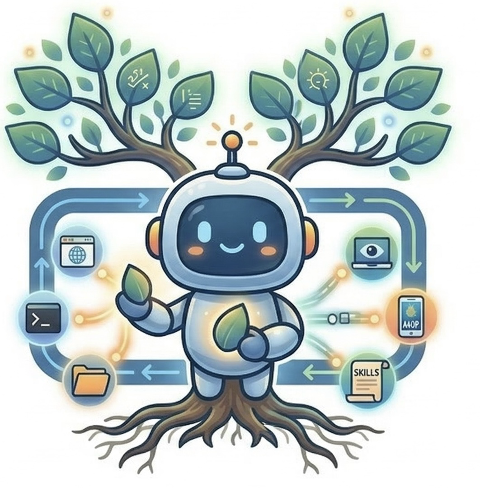
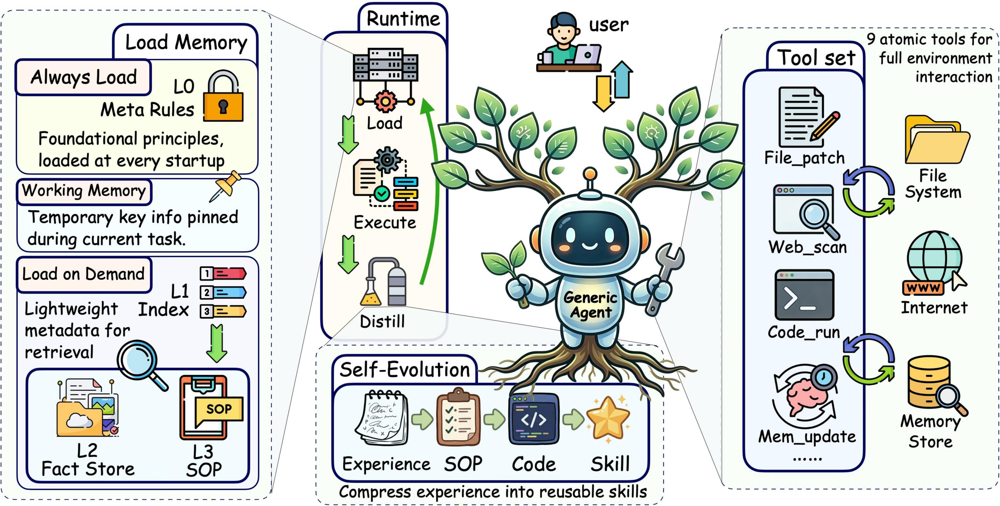
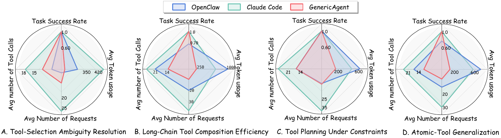
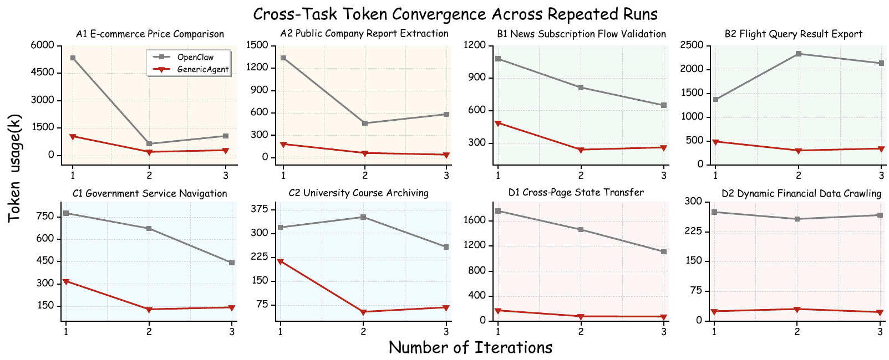

<div align="center">
  

  <h1>GenericAgent (GA)</h1>
  <p><b>A Self-Evolving LLM Agent via Contextual Information Density Maximization</b></p>

  <p>
    <a href="main.pdf"></a>
    <a href="https://github.com/lsdefine/GenericAgent"></a>
    
    
  </p>

  <p><i>Advantage AI Agent Lab (A³ LAB) · Shenzhen Aquaintelling Technology  × Fudan University</i></p>
</div>

---

## 🔥 Highlights

- 🧠 **Self-evolving by design** — an autonomous trajectory → SOP → executable-code distillation pipeline, no manual prompt tuning
- 🪶 **Nine atomic tools, not fifty** — broad capability through composition, not tool enumeration
- 📉 **~1/3 the token cost** of today's leading agent systems, at matched or better task success
- 📚 **No external vector DB needed** — beats embedding-based retrievers on LoCoMo with pure hierarchical memory
- 🔁 **Evolves with use** — nine-round longitudinal runs show **–89.6%** tokens, **–78%** runtime, **–84%** LLM calls


## 🏗️ Architecture at a Glance

<p align="center">
  
</p>

GA follows a unified agent loop that builds an execution context from the current task and relevant memory, emits an output or tool call, and updates the system through structured feedback. The loop is supported by four mechanisms, a minimal atomic tool set, hierarchical memory, reflection-driven self-evolution, and structured browser extraction, that together maximize context information density across the full lifecycle of an interaction.

---

## ⚙️ The Four Core Mechanisms

<p align="center"><i>GA instantiates context information-density maximization across the entire lifecycle of contextual information.</i></p>

### 1. Minimal Atomic Toolset — *density before execution*
Instead of exposing dozens of specialized tools, GA ships **9 atomic primitives** across 5 capability classes (file ops, code execution, web interaction, memory management, human-in-the-loop). Broad capability emerges from *composition*, not enumeration. 
Result: a smaller tool schema, a smaller action space, fewer selection errors, and no prompt bloat.


### 2. Hierarchical Memory — *density during execution*
A layered memory system where **only a compact "always-on" orientation layer** sits in the prompt. Richer factual knowledge (L2), procedural SOPs (L3), and archived interaction history are kept *off-prompt* and retrieved on demand.


### 3. Self-Evolution — *density that compounds over time*
A reflection-driven pipeline that compresses verified trajectories into reusable **SOPs → executable code**, in three autonomous stages (natural-language → textual SOP → codified SOP). Transitions are triggered by the memory system itself, not by the user.


### 4. Context Truncation & Compression — *density preserved under pressure*
Layered management of historical content: head/tail truncation of tool outputs, tag-level compression of older messages, temporal eviction past budget, plus a continuously injected working-memory anchor. The active context stays task-relevant instead of growing linearly with turns.

---

## 🌟 Emergent System Capabilities

On top of the four mechanisms, GA exhibits a set of system-level behaviors that together make it deployable as a *self-driving* agent:

- **Subagent dispatch** — spawn bounded-scope workers with their own tool sets and context budgets
- **Reflect Mode** - continuously monitors for environmental changes and automatically triggers the corresponding task once a specific condition is detected.
  - **Watchdog mode** — reactive execution triggered by environmental events, no user prompt required
  - **Scheduled tasks** — cron-style recurring execution reusing the main agent loop
  

---

## 📈 Evaluation — Five Dimensions

| Dimension | Question | Benchmarks used |
|---|---|---|
| **1. Task Completion & Token Efficiency** | Can GA complete hard tasks more cheaply than leading agents? | SOP-Bench, Lifelong AgentBench, RealFin-Benchmark |
| **2. Tool-Use Efficiency** | Can a minimal atomic toolset solve what specialized toolsets solve, with less overhead? | Tool Efficiency Benchmark (11 simple + 5 long-horizon tasks) |
| **3. Memory System Effectiveness** | Does condensed hierarchical memory beat full/redundant memory and embedding-based retrievers? | SOP-Bench (dangerous goods), LoCoMo, 20-skill stress test |
| **4. Self-Evolution Capability** | Can the agent distill experience into reusable SOPs and code, without intervention? | 9-round LangChain longitudinal study, 8-task cross-task web benchmark |
| **5. Web Browsing Capability** | Does density-driven design survive the open web? | WebCanvas, BrowseComp-ZH, Custom Tasks (22) |

Baselines across these dimensions include **Claude Code**, **OpenAI CodeX**, and **OpenClaw**, evaluated under *Claude Sonnet 4.6*, *Claude Opus 4.6*, *GPT-5.4*, and *MiniMax M2.7* backbones.

<table>
  <tr>
    <td align="center" width="50%">
      <br/>
      <sub><b>Tool-use efficiency radar.</b> GA dominates token, request, and tool-call axes while preserving quality across four task dimensions.</sub>
    </td>
    <td align="center" width="50%">
      <br/>
      <sub><b>Cross-task self-evolution.</b> Second- and third-run GA executions converge to a stable low-cost regime across eight web tasks, while OpenClaw shows no such convergence.</sub>
    </td>
  </tr>
</table>

---

## 📁 Repository Layout

```
GA-Technical-Report/
├── main.pdf                       ← Full technical report (V1.0)
├── README.md                      ← This file
├── assets/                        ← README visuals (logo, framework, demos, result charts)
└── datasets/                      ← All evaluation datasets used in the report
    ├── sop_bench/                    — SOP-Bench (dangerous goods subset, 20 tasks)
    ├── lifelong_agentbench/          — Lifelong AgentBench (DB-Bench, 20 SQL tasks)
    ├── realfin_benchmark/            — RealFin-Benchmark (40 financial analysis tasks)
    ├── tool_efficiency_benchmark/    — 11 simple + 5 long-horizon tool-use tasks (+ assets & graders)
    ├── locomo/                       — LoCoMo long-conversation memory (10 conversations, ~2k QA)
    └── web_browsing/                 — WebCanvas (12) + BrowseComp-ZH (10) per-task runs vs. OpenClaw
```

---


## 📝 Citing GA

```bibtex
@techreport{generic_agent_2026,
  title        = {GenericAgent: A Self-Evolving LLM Agent via Contextual Information Density Maximization},
  author       = {Jiaqing Liang, Jinyi Han, Weijia Li, Xinyi Wang, Zhoujia Zhang, Zishang Jiang, Ying Liao, Tingyun Li, Ying Huang, Hao Shen, Hanyu Wu, Fang Guo, Keyi Wang, Zhonghua Hong, Zhiyu Lu, Lipeng Ma, Sihang Jiang, Yanghua Xiao
},
  institution  = {Shenzhen Aquaintelling and Technology Fudan University},
  year         = {2026},
  type         = {Technical Report},
  version      = {V1.0},
  url          = {https://github.com/JinyiHan99/GA-Technical-Report}
}
```

---


<div align="center">
  <sub>© 2026 Advantage AI Agent Lab (A³ LAB). Released alongside the GenericAgent open-source system at <a href="https://github.com/lsdefine/GenericAgent">github.com/lsdefine/GenericAgent</a>.</sub>
</div>
